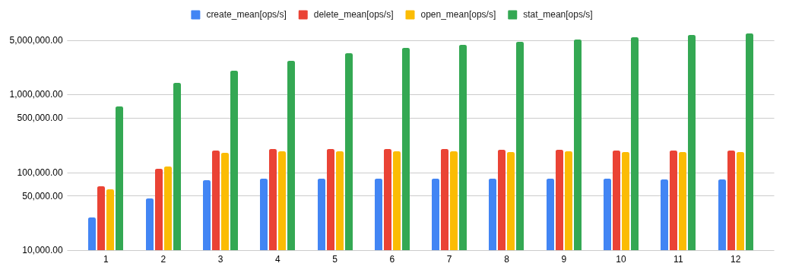
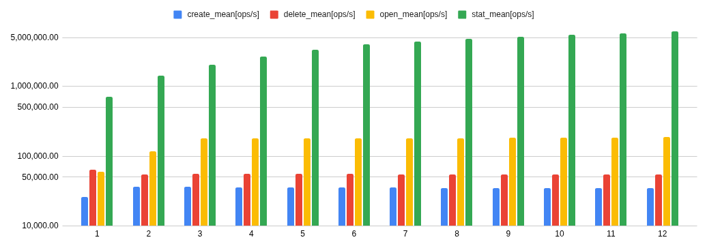

### Benchmark results

I used the provided benchmark called "metadata" with an object count of 100000. I also benchmarked with fio and compared it with the host file system (It was around 6 times faster). The results for the metadata benchmark can be found below, mind the logarithmic scale and the thread count on the X axis. The results suggest good async performance, because the operations per second do not get lower with higher thread counts.







The commands for the measurements where:
```bash
./metadata --path=/tmp/mnt --iterations=10 --objects 100000 --threads=<thread count>

./metadata --path=/tmp/mnt --iterations=10 --objects 100000 --threads=<thread count> --shared
```


### Hardware used

```
System:
  Kernel: 6.14.7-zen1 arch: x86_64 bits: 64 compiler: gcc v: 14.2.1
  Desktop: KDE Plasma v: 6.3.5 Distro: NixOS 25.05 (Warbler)
Machine:
  Type: Desktop Mobo: ASRock model: X670E PG Lightning
    serial: <superuser required> UEFI: American Megatrends LLC. v: 3.01
    date: 05/13/2024
CPU:
  Info: 6-core model: AMD Ryzen 5 7600X bits: 64 type: MT MCP arch: Zen 4
    rev: 2 cache: L1: 384 KiB L2: 6 MiB L3: 32 MiB
  Speed (MHz): avg: 2991 min/max: 545/5457 boost: enabled cores: 1: 2991
    2: 2991 3: 2991 4: 2991 5: 2991 6: 2991 7: 2991 8: 2991 9: 2991 10: 2991
    11: 2991 12: 2991 bogomips: 112589
  Flags: avx avx2 ht lm nx pae sse sse2 sse3 sse4_1 sse4_2 sse4a ssse3 svm
Graphics:
  Message: Required tool lspci not installed. Check --recommends
  Display: wayland server: X.org v: 1.21.1.16 with: Xwayland v: 24.1.6
    compositor: kwin_wayland driver: N/A resolution: 1: 1920x1080~60Hz
    2: 1920x1080~144Hz 3: 3840x2160~60Hz
  API: EGL Message: EGL data requires eglinfo. Check --recommends.
  Info: Tools: de: kscreen-console,kscreen-doctor x11: xprop,xrandr
Audio:
  Device-1: Burr-Brown from TI USB Audio CODEC
    driver: hid-generic,snd-usb-audio,usbhid type: USB bus-ID: 7-2.3:4
  API: ALSA v: k6.14.7-zen1 status: kernel-api
  Server-1: PipeWire v: 1.4.2 status: active
  Server-2: PulseAudio v: 17.0 status: off (using pipewire-pulse)
Network:
  Message: Required tool lspci not installed. Check --recommends
  IF-ID-1: enp16s0 state: up speed: 1000 Mbps duplex: full mac: <filter>
  IF-ID-2: wlp19s0 state: down mac: <filter>
Bluetooth:
  Device-1: N/A driver: btusb v: 0.8 type: USB bus-ID: 1-9:2
  Report: hciconfig ID: hci0 rfk-id: 2 state: down
    bt-service: enabled,running rfk-block: hardware: no software: no
    address: <filter>
Drives:
  Local Storage: total: 5.68 TiB used: 2.32 TiB (40.8%)
  ID-1: /dev/nvme0n1 vendor: Samsung model: MZVLW128HEGR-00000
    size: 119.24 GiB temp: 40.9 C
  ID-2: /dev/nvme1n1 vendor: Samsung model: SSD 970 EVO Plus 2TB
    size: 1.82 TiB temp: 45.9 C
  ID-3: /dev/sda vendor: SanDisk model: SDSSDHII120G size: 111.79 GiB
  ID-4: /dev/sdb vendor: Western Digital model: WD40EZAZ-00SF3B0
    size: 3.64 TiB
Partition:
  ID-1: / size: 1.82 TiB used: 176.06 GiB (9.5%) fs: btrfs dev: /dev/nvme1n1p2
  ID-2: /boot size: 548.9 MiB used: 48.9 MiB (8.9%) fs: vfat
    dev: /dev/nvme1n1p1
  ID-3: /home size: 1.82 TiB used: 176.06 GiB (9.5%) fs: btrfs
    dev: /dev/nvme1n1p2
Swap:
  ID-1: swap-1 type: file size: 16 GiB used: 0 KiB (0.0%) file: /swap/swapfile
Sensors:
  Src: /sys System Temperatures: cpu: 52.8 C mobo: 47.0 C
  Fan Speeds (rpm): N/A
  GPU: device: amdgpu temp: 57.0 C fan: 247 device: amdgpu temp: 48.0 C
Info:
  Memory: total: 32 GiB note: est. available: 30.47 GiB used: 7.24 GiB (23.8%)
  Processes: 432 Uptime: 3h 29m Init: systemd
  Packages: 1789 Compilers: gcc: 14.2.1 Shell: Bash v: 5.2.37 inxi: 3.3.38
```